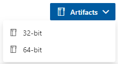
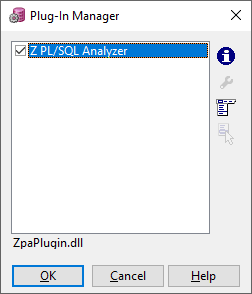
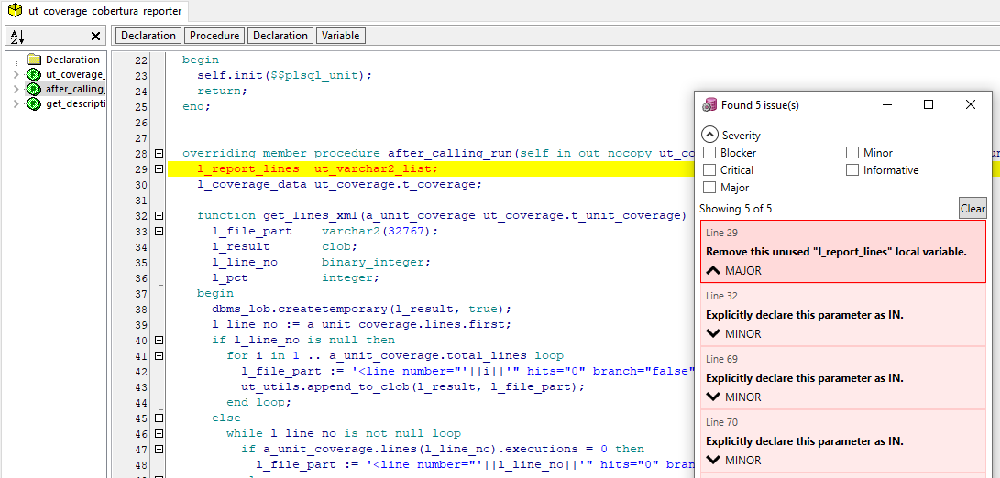

# Z PL/SQL Analyzer for PL/SQL Developer

The [Z PL/SQL Analyzer](https://github.com/felipebz/zpa) (or simply ZPA) is a code analyzer for PL/SQL and Oracle SQL code. This repository contains the ZPA plugin for [Allround Automations PL/SQL Developer](https://www.allroundautomations.com/products/pl-sql-developer/).

## Installation

Note that this is work in progress and it has a lot of rough edges.

* Open the [build pipeline](https://dev.azure.com/felipebz/z-plsql-analyzer/_build/latest?definitionId=11&branchName=master) and download the plugin from the "Artifacts" button. You must the download the artifact corresponding to your PL/SQL Developer installation.

* Extract the file to <PLSQL Developer folder>\PlugIns.

* Run PL/SQL Developer and confirm that the plugin was recognized (menu Tools > Configure Plug-Ins).

## Usage

Open a program file and execute an analysis using the option "Analyze with ZPA" in the Tools menu.

